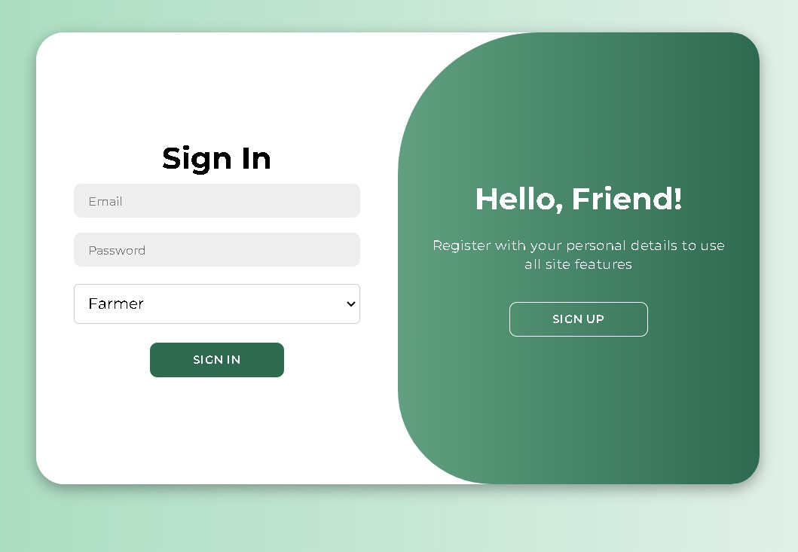
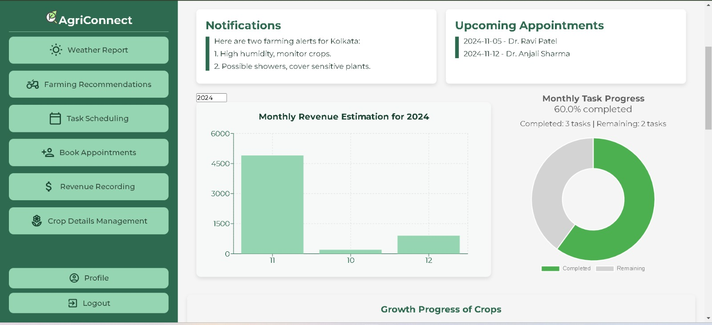

# AgriConnect: Where Farmers Meet Experts & Technology for a Greener Future! 🌾





**AgriConnect** is an innovative platform designed to empower farmers by connecting them with agricultural experts and modern technology. Our goal is to make farming smarter, more efficient, and more sustainable. By integrating AI-powered crop recommendations, real-time weather updates, expert consultations, and effective task management, we aim to revolutionize the way farming is done.

## 🚀 Features and Functionalities

### 1. **Instant Access to Experts** 🎥
   - **What it does:** Get real-time assistance from top agricultural experts via chat or video calls.
   - **How it works:** Farmers can book video consultations or chat with experts, receiving personalized advice for crop management, pest control, irrigation methods, and more.
   - **Technology Used:** WebRTC for real-time video calls and socket.io for chat functionality.

### 2. **The Ultimate Farming Hub** 🌱
   - **What it does:** Stay updated with the latest farming news, expert advice, and tech advancements—all in one place.
   - **How it works:** AgriConnect aggregates agricultural news, expert articles, and the latest farming trends to keep farmers informed about the world of agriculture.
   - **Technology Used:** React.js for the frontend, MongoDB for storing articles and news data.

### 3. **Simplified Task Scheduling & Planning** 📅
   - **What it does:** Manage farming tasks with goal-based scheduling, keeping track of deadlines and pending work.
   - **How it works:** Farmers can create, track, and complete tasks through interactive goal-based scheduling charts, ensuring their daily and monthly objectives are met.
   - **Technology Used:** Node.js for backend scheduling logic and chart.js for visual task tracking.

### 4. **Crop Management & Yield Tracking** 🌾
   - **What it does:** Visualize crop growth and track historical yield data.
   - **How it works:** Through interactive graphs and charts, farmers can monitor the progress of their crops and see trends over time, helping them make informed decisions about their crops and irrigation needs.
   - **Technology Used:** MongoDB for storing crop data and chart.js for real-time visualization.

### 5. **Weather Alerts & Recommendations** ☔
   - **What it does:** Receive real-time weather updates and actionable recommendations.
   - **How it works:** Based on the farmer's region, the app sends out weather alerts (like storms or drought warnings) and personalized tips on how to adjust farming practices in response.
   - **Technology Used:** Weather APIs (like OpenWeather) for real-time data, Node.js for processing, and push notifications.

### 6. **Personalized Crop Recommendations with Gemini AI** 🌟
   - **What it does:** Get AI-powered crop recommendations based on your farm's specific conditions.
   - **How it works:** By feeding information about your farm's soil quality, pest issues, and climate, Gemini AI generates tailored suggestions for crop choices, irrigation practices, and pest management.
   - **Technology Used:** Gemini AI API for personalized crop recommendations.

### 7. **Income & Revenue Management** 💵
   - **What it does:** Keep track of farm income, expenses, and profitability.
   - **How it works:** Farmers can record their income from crops and sales, track their expenses, and manage finances through a user-friendly dashboard.
   - **Technology Used:** MongoDB for data storage, React.js for frontend display.

## 🛠️ Technologies Used

- **Frontend:**
  - **React.js** – A JavaScript library for building interactive user interfaces.
  - **Chart.js** – For rendering interactive graphs and charts.
  - **WebRTC** – For real-time video calling.
  
- **Backend:**
  - **Node.js** – JavaScript runtime for building the backend.
  - **Express.js** – Web framework for Node.js, used to build APIs and manage routes.
  - **Socket.io** – Real-time communication for chat and live updates.
  - **MongoDB** – NoSQL database to store user data, crop info, task schedules, and more.
  
- **Third-party APIs:**
  - **Gemini AI** – For personalized crop recommendations.
  - **OpenWeather API** – For real-time weather data.

  ## 🚀 Future Scope

AgriConnect aims to continuously evolve and integrate more features to enhance the farming experience. Here are some of the key areas where we plan to take the app further:

1. **Seamless Video Calls & Real-Time Chat**  
   We aim to enhance the communication experience by integrating a smoother, more efficient video call and real-time chat feature for farmers to interact with experts. This will provide more personalized, live consultations and quick resolutions for any farming-related queries.

2. **Advanced AI-Powered Recommendations**  
   In the future, we plan to integrate advanced AI models that will analyze more diverse data sources like satellite imagery and weather forecasts to give even more precise, location-specific crop recommendations and environmental insights.

3. **Smart Farm Management Tools**  
   We want to incorporate tools for farmers to manage their farms more effectively, including automated irrigation systems, smart soil moisture sensors, and crop health monitors. These features will provide farmers with actionable data to optimize crop yields.

4. **Community Features & Farmer Networks**  
   We plan to introduce social and community features where farmers can interact, share tips, and collaborate on farming best practices. This will also help farmers create networks of support for better decision-making.

5. **Integration with IoT Devices**  
   Integrating IoT sensors to monitor soil health, weather conditions, and crop status in real-time. This data can be fed into the app to give farmers live updates and predictions for better crop management.

6. **Language Support & Regional Customization**  
   Adding support for multiple languages to cater to farmers from diverse regions, along with localized farming practices and crop data tailored to specific geographic areas.

---

## 🛠 Challenges We Faced

During the development of AgriConnect, we encountered a few hurdles that required creative problem-solving:

1. **CORS Issues**  
   We faced multiple challenges with CORS (Cross-Origin Resource Sharing) errors when connecting the frontend to the backend. This required fine-tuning our server configurations to ensure smooth communication between the client and server.

2. **Socket Integration for Video Calls & Real-Time Chat**  
   Integrating WebSocket for real-time chat and video calls proved difficult, especially when synchronizing events between the user interface and server. Ensuring reliable connections and timely notifications required extra testing and debugging.

3. **Gemini API Integration**  
   The integration of the Gemini API for AI-powered crop recommendations was initially complex. We had to carefully structure and test the data flow to ensure accurate recommendations for farmers based on their farm conditions.

4. **Task Scheduling & Notifications**  
   We ran into issues with scheduling tasks and sending timely notifications to farmers. Ensuring that notifications for task deadlines, expert appointments, and weather alerts were accurate and timely was a significant challenge.

5. **User Authentication & Session Management**  
   Implementing a robust user authentication system that could handle different user roles (admin, experts, farmers) while maintaining security and smooth transitions was another challenge we had to work through.

6. **Optimizing the App for Mobile**  
   Given that most farmers will access the app on mobile devices, optimizing the app’s performance and user interface for different screen sizes was a key challenge that we overcame by implementing responsive design principles.

---

This is just the beginning for AgriConnect, and we are excited about its future. Each challenge we faced has made the app stronger, and we look forward to implementing these new features and improvements to make farming smarter and more sustainable. 🌱

  

## ⚙️ How to Clone & Run the Project

1. **Clone the Repository:**

   ```bash
   git clone https://github.com/your-username/agriconnect.git
   ```
2. **Install Dependencies:**

   Navigate into the project directory and install the required dependencies.

   ```bash
   cd agriconnect
   npm install
   ```
3.**Set up Environment Variables:**

  Create a .env file in the root directory and add the necessary variables, such as API keys for Gemini AI and OpenWeather, and database credentials for MongoDB.  

  ```bash
   GEMINI_API_KEY=your-api-key
   OPENWEATHER_API_KEY=your-api-key
  MONGODB_URI=your-mongodb-uri
 ```
4. **Start the Development Server:**

  Run the following command to start the backend and frontend servers:
  ```bash
   npm run dev
  ```
5.**Access the Application:**

 Open your browser and go to http://localhost:5173 to view the AgriConnect app.

 ## 📺 Video Demo

Watch the demo of AgriConnect in action here:  
[AgriConnect Demo Video](https://youtu.be/hSKtcfGDbI8)

## 🤝 Contributing

We welcome contributions to AgriConnect! If you have ideas to enhance the app or find bugs, feel free to open an issue or submit a pull request.

## 📄 License

This project is licensed under the MIT License - see the [LICENSE](LICENSE) file for details.

---

**AgriConnect: Empowering farmers with technology for a greener, smarter future!** 🌱


   

   


## This repo is participating in Hack This Fall 2024 virtual online 36 hr hackathon and  in the following challenges 
- **Best use of github**
- **Best use of Gemini APi**
- **Best use of MongoDb Atlas**
- **Best first time hackers**

